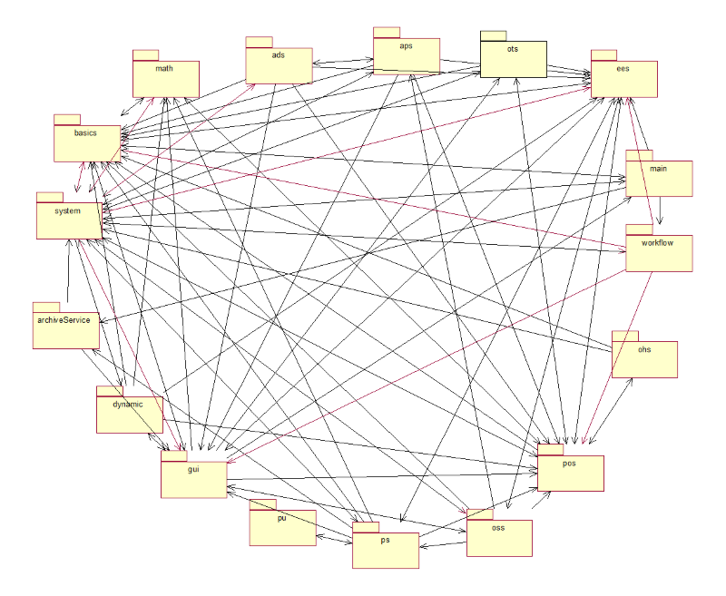
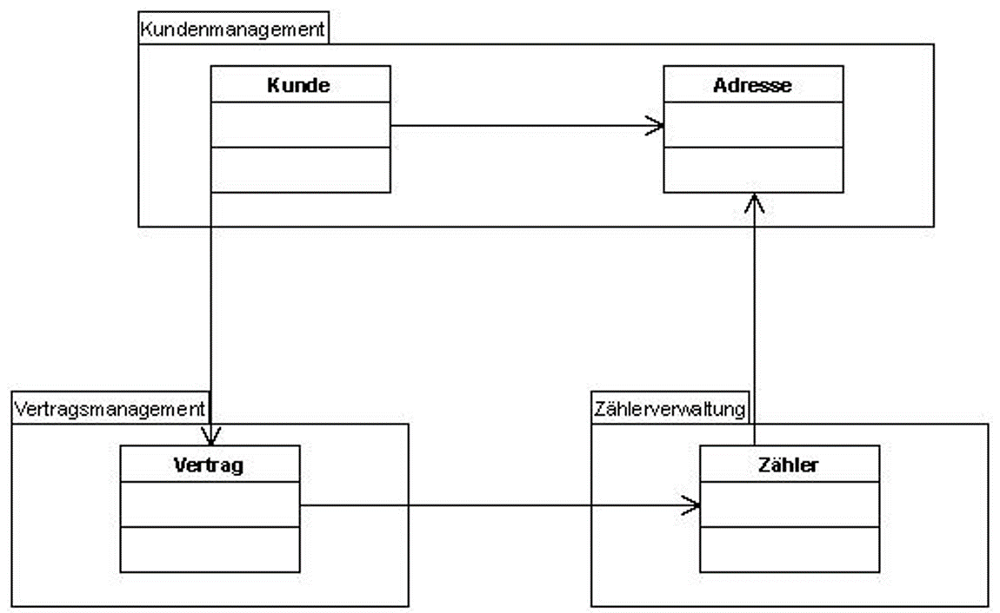
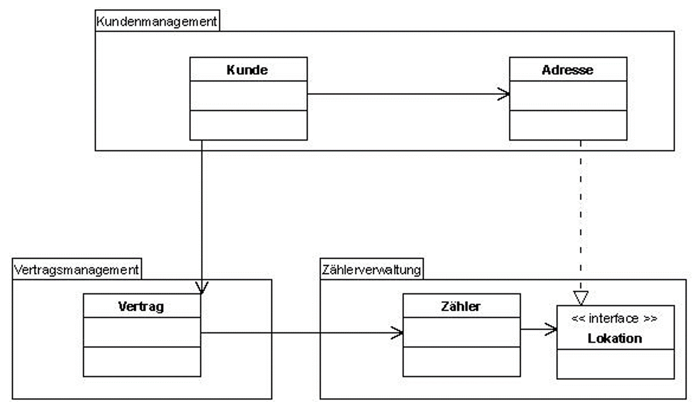

title: Einführung
permalink: /02-vorlesung/
layout: page

---

# Objektorientiertes Programmieren

Einführung in objektorientiertes Programmieren

## Bachelor Wirtschaftsinformatik

**Marcel Tilly**

Fakultät Informatik, Cloud Computing

---
- Java ist nicht die erste objektorientierte Sprache (OO-Sprache)
- C++ war nicht die erste
- Klassischerweise gelten Smalltalk und insbesondere Simula-67 aus dem Jahr 1967 als Stammväter aller OO-Sprachen
- Die eingeführten Konzepte sind bis heute aktuell

---
# Warum überhaupt OOP?

- Menschen nehmen die Welt in Objekten wahr
- Objektorientiertes Design mit prozeduralen Systemen ist schwierig (Programme, Unterprogramme,..)

=> Programm-Design wird durch Objekte und Klassen einfacher

---
# OOP Prinzipen 
OOP stützt sich auf die Konzepte von Objekten und Klassen (Typedefintion von Objekten).

Es gilt:

1. Alles ist ein Objekt (manchmal gibt es Ausnahmen, z.B. Basistypen)
2. Objekte kommunizieren durch das Senden und Empfangen von Nachrichten (Wie funktioniert das in Java?)
3. Jedes Objekt ist die Instanz einer Klasse. Die Klasse definiert die Struktur aller ihrer Instanzen

---
## Eigenschaften OOP

Grundsätzlich bieten Objekte die folgenden Vorteile:

- Abstraktion
- Kapselung
- Vererbung
- Polymorphie

---

# Objekte haben 4 wichtige Eigentschaften

- Jedes Objekt hat eine **Identität** (bleibt erhalten während der Lebenszeit!)
- Jedes Objekt hat einen **Zustand** (Bildet eine Einheit von Daten und Funktionaltät)
- Jedes Objekt hat ein Verhalten
- Jedes Objekt bietet eine Schnittstelle (Interface) zur Interaktion 

---
# Motivation: "Bad design smells!"

---

# Good Design

---

# Bad Design: Wie kann das passieren?

---

# Good Design

---

# Better Design

---

# Why does it matter?

**Klare Struktur – klare Sprache**
- Eindeutige Abhängigkeiten
- modular

**Effekt**
- Definierte Verantwortlichkeiten
- Einfachere Wartung
- Einfachere Änderungen
- Effizienter
- Besser zu testen

---

# Fragen?
