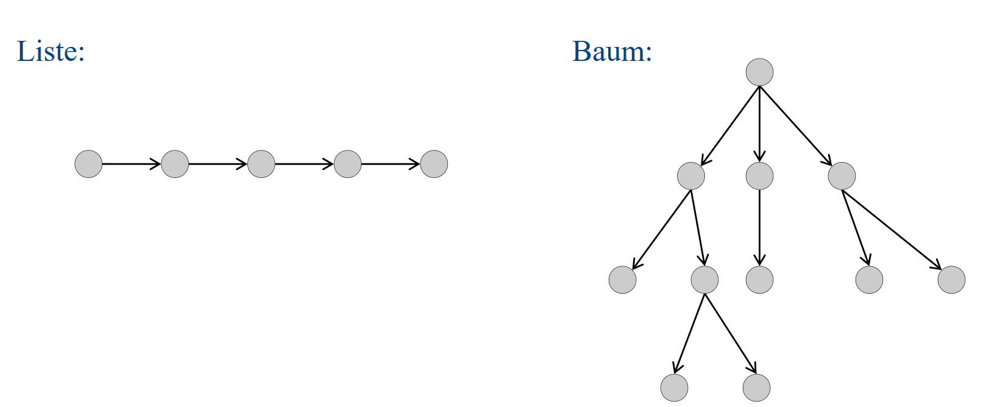
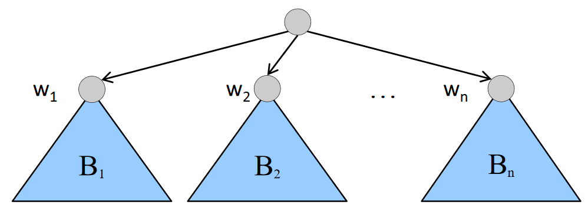
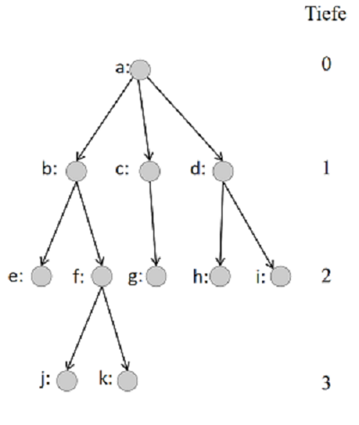

class: title-slide  

# Modul - Objektorientierte Programmierung
### Bachelor Wirtschaftsinformatik

## 03 - Trees und Sets
### Prof. Dr. Marcel Tilly
Fakultät für Informatik, Cloud Computing

---

# Ziele
- Den Begriff des _Baums_ in der Informatik kennenlernen
- Bäume als verkettete Datenstruktur repräsentieren können
- Rekursive Funktionen auf Bäumen verstehen und schreiben können

---

# Bäume

- Bäume sind eine der am meisten verwendeten Datenstrukturen in der Informatik
- Bäume verallgemeinern Listen:

	- In einer Liste hat jeder Knoten höchstens einen Nachfolger
	- In einem Baum kann ein Knoten mehrere Nachfolger haben.

.center[]

---

# Definition (1/2): Bäume 

1. Ein **Baum** besteht aus **Knoten**, die durch **Kanten** miteinander verbunden sind. 

2. Ein **Wurzelknoten** (_Root_) ist ein Knoten, auf den keine Kante zeigt.

3. In einem Knoten können je nach Anwendung verschiedene Daten gespeichert sein.

---

# Definition (2/2): Bäume 

4. Die Menge aller Bäume wird durch folgende Regeln konstruiert:

	- Es gibt einen leeren Baum.

	- Ein einzelner Knoten ohne irgendwelche Kanten ist ein Baum (Root).

	- Ist n > 0 und sind _B1,B2, ...Bn_ Bäume mit Wurzelknoten _w1,w2, ... wn_, so kann man diese zu einem größeren Baum zusammensetzen, indem man einen neuen Knoten hinzufügt und diesen mit w1,w2, ..., wn verbindet. 

	- Der neue Knoten ist dann Wurzelknoten des so aufgebauten Baums.

.center[]

---
class: split

# Bäume

#### Terminologie (1/2)

.column[
- a ist der **Wurzelknoten** des Baums.
- h und i sind die **Nachfolger-** oder auch **Kindknoten** des Knotens d.
- d ist **Vorgänger-** oder **Elternknoten** von h.
- Knoten ohne Nachfolger (hier: e, j, k, g, h, i) heißen **Blattknoten**
- Die **Tiefe eines Knotens** im Baum ist die Anzahl der Schritte, die benötigt werden, um den Knoten von der Wurzel zu erreichen.
- Die **Tiefe des Baums** ist das Maximum der Tiefen aller Knoten des Baums. (hier: 3)
- Ein Baum ist ein **Binärbaum**, wenn jeder Knoten darin **höchstens** zwei Nachfolger hat.
]

.column[
.center[]
]

---

# Bäume

#### Terminologie (2/2)

- Jeder Knoten in einem Baum ist Wurzel eines **Teilbaums** des gegebenen Baums.

- Der Teilbaum mit Wurzel k besteht aus dem Knoten k, seinen Kindern, Kindeskindern, usw.
	- Beispiele: Der Teilbaum mit Wurzel b und der mit Wurzel d. Im Vergleich dazu der Teilbaum mit Wurzel a ist der ganze Baum selbst.

- Die Teilbäume mit Wurzeln b und d sind beide Binärbäume.

- Der gesamte Baum ist kein Binärbaum.

---

# Fragen?
