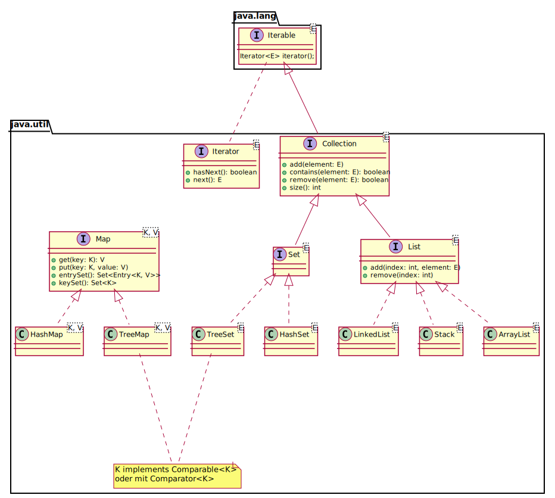

# Wiederholung: Liste und Set

Wir haben nun mit der [Liste](/02-linked-list/) als _sequenziellen_ und dem [Set bzw. Binärbaum](/03-tree-set/) als _duplikatfreien_ Container bereits zwei der drei wichtigsten und grundlegenden Datenstrukturen der Informatik kennengelernt.
Beide hatten wir mit verschiedenen Beispielen veranschaulicht.

Da die _Liste_, im Gegensatz zu einem Array, dynamisch wachsen und schrumpfen kann, ist sie immer dann die richtige Wahl, wenn zur Entwicklungszeit nicht bekannt ist, wie viele Elemente gespeichert werden müssen.
Typische Beispiele dafür sind z.B. die [Agenda bei der Iteration](/05-iterator/#iteration-für-sets), oder die Arbeit mit Benutzereingaben:

```java
BufferedReader br = new BufferedReader(new InputStreamReader(System.in));

List<String> entries = new LinkedList<>();
while (true) {
	System.out.print("Eingabe: ");
	String line = br.readLine();

	if (line == null)
		break;

	entries.add(line);
}

System.out.println("\nEingabe: " + entries);
```

Wenn wir obendrein wissen wollten, ob ein Element einzigartig ist, so konnten wir zusätzlich ein _Set_ zu Rate ziehen:

```java
Set<String> set = new TreeSet<>();
while (true) {
	// ...
	if (set.contains(line)) {
		System.out.println("Entschuldigung, der Eintrag ist bereits vergeben.");
		continue;
	} else {
		entries.add(line);
		set.add(line);
	}
	// ...
}
```


Aber was nun, wenn man in obigen Beispiel Duplikate nicht verhindern möchte, sondern im Gegenteil _mitzählen_ möchte, wie oft ein bestimmter Eintrag vor kam?
Man bräuchte also eine Datenstruktur, welche in obigen Beispiel zu einem `String` (einem Eintrag) einen `Integer` Wert (die Anzahl) speichert.


# Assoziatives Datenfeld: Map

Heute fügen wir eben dafür die dritte (und für dieses Semester letzte) Datenstruktur hinzu: das assoziative Datenfeld (engl. _map_), welches zu einem Schlüsselobjekt genau ein Wertobjekt speichert bzw. liefert.
Mathematisch betrachtet stellt die Map eine Funktion dar, welche einen Schlüsselwert auf einen Datenwert abbildet: $\text{map}: K \rightarrow V$.

In Java ist diese Datenstruktur als generisches Interface definiert:

```java
interface Map<K, V> {
	void put(K key, V value);
	V get(K key);
	boolean containsKey(K key);
}
```

Auffallend ist dabei, dass die `Map` über **zwei** Typvariablen verfügt: `K` für den Schlüsseltyp (_key_) und `V` für den Wertetyp (_value_).
Eine Map ähnelt einem Set dahin gehend, dass es eine Methode zum Hinzufügen von Assoziationen gibt (`put`), sowie eine um von einem Schlüssel auf den Wert aufzulösen (`get`).
Eine Map ist also dahingehend ein Set, dass jeder Schlüssel nur genau einmal enthalten ist; es können allerdings mehrere Schlüssel auf das selbe Wertelement zeigen.
Statt einer `contains` Methode gibt es die spezifischere `containsKey` Methode, um Missverständnissen vorzubeugen.

> Hinweis: Andere Sprachen wie z.B. python, C\# oder JavaScript haben assoziative Speicher als Sprachelement.
> In Java wird diese Funktionalität von der Java API bereit gestellt.
> Das "offizielle" Java Interface `java.util.Map` hat zusätzlich noch weitere Methoden, auf die wir später noch kurz eingehen werden.

Hätten wir nun eine Implementierung einer solchen `Map`, so könnten wir für eine Liste von Strings recht einfach auszählen, welcher String wie oft vorkommt:

```java
Map<String, Integer> zaehler = ???;  // dazu später

for (String s : "In Ulm und um Ulm und um Ulm herum".split(" ")) {
	int z = 0;
	// bisherigen Wert holen, sofern vorhanden
	if (zaehler.containsKey(s))
		z = zaehler.get(s);
	zaehler.put(s, z+1);
}
```

## Implementierung

Eine Map ist also eine eindeutige Abbildung von einem Schlüssel auf einen Wert ($m: k \rightarrow v$).
Oder anders formuliert: eine Map ist eine Menge von Schlüssel-Wert-Paaren (Einträgen, engl. _entries_), wobei jeder Schlüssel genau einmal vorkommen darf.
Wollen wir diese Einträge nun im Hinblick auf den Schlüssel duplikatfrei speichern, so müssen wir die [`equals` Methode überschreiben](/04-generics/#objektgleichheit-mit-equals).

```java
class Entry<K, V> {
	K key;
	V value;

	public boolean equals(Object other) {
		if (other == null) return false;
		if (this == other) return true;
		if (!(other instanceof Entry)) return false;
		// Entry<K, V> that = (Entry<K, V>) other;
		Entry that = (Entry) other;
		return this.key.equals(that.key);
	}
}
```

Wie wir aus den Kapiteln [3 (Set)](/03-tree-set/) und [4 (Generics)](/04-generics/) wissen, können wir ein Set effizient als Binärbaum implementieren, sofern die Paare [`Comparable` implementieren](/04-generics/#objektvergleich-mit-compareto).
Da wir wiederum nur am Vergleich von Schlüsseln interessiert sind, so genügt es den Vergleich an diese zu _delegieren:_

```java
class Entry<K extends Comparable<K>, V> implements Comparable<Entry<K, V>> {
	// ...
	public int compareTo(Entry<K, V> other) {
		return this.key.compareTo(other.key);
	}
}
```

Wir erweitern `Entry` noch um einen linken und rechten Nachfolger, und implementieren die Map als Baumstruktur:

```java
class TreeMap<K extends Comparable<K>, V> implements Map<K, V> {
	class Entry<K extends Comparable<K>, V> implements Comparable<Entry<K, V>> {
		// ...
		Entry<K, V> left, right;
		Entry(K key, V value) {
			this.key = key;
			this.value = value;
		}
		// ..
	}

	Entry<K, V> root;

	// ...
}
```

Im Repository finden Sie eine [vollständige Implementierung](https://github.com/hsro-wif-prg2/hsro-wif-prg2.github.io/blob/master/examples/src/main/java/ch06/TreeMap.java).

Damit können wir den Test nun abschließen:

```java
Map<String, Integer> zaehler = new TreeMap<>();

for (String s : "In Ulm und um Ulm und um Ulm herum".split(" ")) {
	int z = 0;
	// bisherigen Wert holen, sofern vorhanden
	if (zaehler.containsKey(s))
		z = zaehler.get(s);
	zaehler.put(s, z+1);
}

assertEquals(3, (int) zaehler.get("Ulm"));
assertEquals(2, (int) zaehler.get("und"));
assertEquals(1, (int) zaehler.get("herum"));
```


## Map.Entry und Iteration

Im gegensatz zur Liste und zum Set fällt auf, dass die Map bisher keinen Iterator hat, obwohl es offensichtlich als Container fungiert.
Das liegt daran, dass nicht eindeutig ist, was die Aufzählung einer Map denn wäre; es kommen nämlich drei Dinge in betracht:

- Die Menge der Schlüsselwerte (engl. _key set_)
- Die enthaltenen Werte (engl. _values_); **Achtung:** kann doppelte Elemente enthalten!
- Die Menge der Schlüssel-Wert-Paare (engl. _entry set_).

Um die Schnittstelle von Map entsprechend anzupassen, müssen wir für das entry set allerdings ein _weiteres_ Interface hinzufügen:

```java
interface Map<K, V> {
	// ...
	Set<K> keySet();         // alle Schlüssel
	Collection<V> values();  // alle Werte, Duplikate möglich; java.util.Collection

	// inneres Interface Map.Entry
	interface Entry<K, V> {
		K getKey();
		V getValue();
		V setValue(V value);
	}

	Set<Map.Entry<K, V>> entrySet();
}
```

Um nun diese drei Methoden `keySet`, `values` und `entrySet` zu implementieren, müssen wir den Baum mit einer Agenda traversieren:

```java
class TreeMap<K extends Comparable<K>, V> implements Map<K, V> {
	// ...
	public Set<K> keySet() {
		Set<K> keys = new TreeSet<>();
		List<Entry<K, V>> agenda = new LinkedList<>();

		if (root != null)
			agenda.add(root);

		while (agenda.size() > 0) {
			Entry<K, V> e = agenda.remove(0);

			keys.add(e.getKey());

			if (e.left != null)
				agenda.add(e.left);
			if (e.right != null)
				agenda.add(e.right);
		}

		return keys;
	}

	// values() und entrySet() analog.
}
```

## Weitere nützliche Funktionen

- `remove`: Löscht einen Schlüssel und den zugehörigen Wert
- `size`: Anzahl der Einträge in der Map
- `containsValue`: Prüft ob ein _Wert_ (nicht Schlüssel) enthalten ist
- `clear`: Löscht alle Schlüssel und zugehörigen Werte


# Exkurs: Effizienz durch Hashing

Obwohl eine Baumstruktur im Mittel eine gute Wahl ist, gibt es Fälle in denen Schlüssel entweder schlecht (oder nur aufwändig) vergleichbar sind, oder ein schnellerer Zugriff auf die Einträge erwünscht ist.

Könnte man ein Schlüsselobjekt einfach auf einen Arrayindex "umrechnen," so könnte man den einfachen Direktzugriff von Arrays verwenden.
Für diese Umrechnung verwendet man eine sogennante _Hashfunktion_, eine Funktion, welche ein Objekt in einen `int` "umrechnet."


Quelle: [Wikimedia Commons](https://commons.wikimedia.org/wiki/File:Hash_table_3_1_1_0_1_0_0_SP.svg)


## Hashing für Schlüsselobjekte

Für Schlüsselobjekte wird hier die Methode `Object.hashCode` ([Doku](https://docs.oracle.com/javase/10/docs/api/java/lang/Object.html#hashCode)) verwendet, welche für alle Klassen der Java API (String, Double, etc.) implementiert ist.

Möchte man eigene Klassen verwenden, so muss man `hashCode` entsprechend implementieren:

```java
class MeineKlasse {
	int a;
	String s;
	public int hashCode() {
		return s.hashCode() + a;  // zum Beispiel...
	}
}
```

In der Praxis verwendet man dazu eine Hilfsbibliothek wie z.B. der `HashCodeBuilder` aus Apache Commons Lang 3:

```java
import org.apache.commons.lang3.builder.HashCodeBuilder;

class MeineKlasse {
	int a;
	String s;
	public int hashCode() {
		// wähle zwei beliebige ungerade Zahlen
		HashCodeBuilder b = new HashCodeBuilder(17, 19);

		// füge alle wichtigen Elemente an
		b.append(a).append(s);

		return b.hashCode();
	}
}
```


## Abbildung auf Array Index

Wie bildet man nun einen Hashwert eines Schlüssels auf einen Arrayindex ab?
Immerhin ist der Wertebereich von `int` durchaus groß -- zum einen würde der Speicher für ein solch großes Array nicht reichen, zum anderen wäre dieses dann vermutlich überwiegend leer.

Man behilft sich anders: Man wählt zunächst Arraygrößen aus, welche eine Zweierpotenz darstellen, also z.B. 4, 8, 32, 256 usw.
Es gibt also entsprechend Arrayindizes von 0..3, 0..8, 0..31, usw.
Ein mathematischer Kniff (und das Wissen um das Binärsystem) helfen hier: Der Index im Array wird berechnet als `(array.length - 1) & key.hashCode()`, wobei `&` der Bitweise UND Operator ist.

Ein Beispiel: Ein Objekt habe den `hashCode` von 42, das Array habe eine Länge von 16: 

```java
K[] array = new K [16]
int hash = key.hashCode();  // 42

int index = (array.length - 1) & hash;

// array.length - 1 in binary:  001111
// hash             in binary:  101010
// 15 & 42       bitweise UND:  001010
//                              ...zwischen 0..16
```

So kann also einfach für einen Hash der zugehörige Arrayindex berechnet werden.
Übertragen auf die Einträge einer Hashmap bedeutet das sehr einfache `get` und `put` Methoden:

```java
class HashMap<K, V> implements Map<K, V> {
	// ...
	Map.Entry<K, V>[] bins = new Map.Entry<> [32];  // Multiple von 2	
	public V get(K key) {
		// & bit-weises UND, daher bleiben genau 0..bins.length-1
		int index = (bins.length - 1) & key.hashCode();
		return bins[index];
	}
	public V put(K key, V value) {
		int index = (bins.length - 1) & key.hashCode();
		return bins[index] = value;
	}
}
```

## Kollisionen

Nun kann es aber natürlich sein, dass zwei Hashwerte auf den selben Index abgebildet werden.
So zum Beispiel 170 und 42, welche sich in den letzten 4 Bit nicht unterscheiden:

```
 42: 0010 1010
128: 1010 1010
 15: 0000 1111 (Maske)
```

Dieses Phänomen nennt man eine _Kollision_.
Der Ausweg für eine Map ist hier, unter einem Hashwert eben nicht einen einzelnen Eintrag abzulegen, sondern eine Liste.


Quelle: [Wikipedia](https://en.wikipedia.org/wiki/File:Hash_table_5_0_1_1_1_1_0_LL.svg)


# Zusammenfassung



- Die grundlegenden Datenstrukturen in der Informatik sind
	+ `List` ist eine sequenzielle Datenstruktur, realisiert z.B. als `ArrayList` oder `LinkedList`
	+ `Set` ist eine duplikatfreie (ungeordnete) Menge, realisiert z.B. als `HashSet` oder `TreeSet`
	+ `Map` ist eine assoziative Datenstruktur, welche Schlüssel auf Werte abbildet, realisiert z.B. als `HashMap` oder `TreeMap`
- Beim Programmieren:
	+ _definieren_ Sie Variablen als _Schnittstellen_
	+ _initialisieren_ Sie die Variablen von Klassen der Java API
	+ z.B. `Set<String> s = new TreeSet<>()`
	+ Vermeiden Sie die Verwendung von _raw types_ (unparametrisierten generischen Klassen), verwenden Sie also z.B. immer `List<...>` statt `List`.
- Werden Datenstrukturen mit eigenen Klassen verwendet, so sollte **unbedingt** 
	+ `equals` zur Prüfung auf Wertgleichheit implementiert werden
	+ `hashCode` implementiert Werden, sofern Hashing verwendet word
	+ `Comarable<T>` implementiert werden, sofern Objekte verglichbar sein sollen.
- `Collections` sind `Iterable`, man kann diese also in `for-each` Schleifen verwenden, oder einen `Iterator` zur Traversierung erhalten.


<p style="text-align: right">&#8718;</p>
