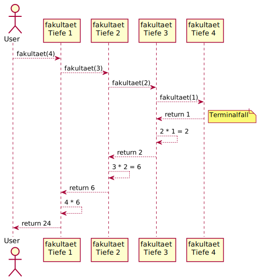
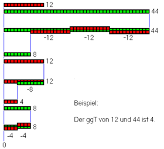
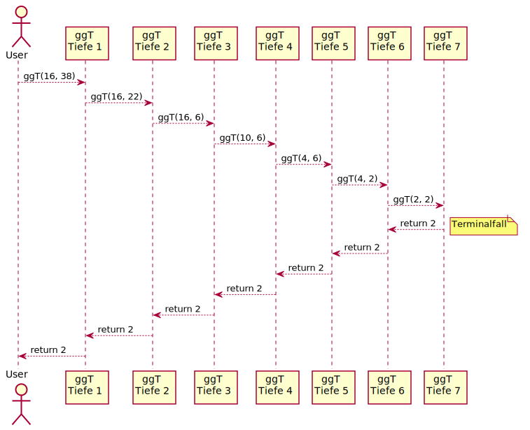

# Rekursion


**Definition**
: Eine _rekursive Funktion_ ist eine Funktion, die sich selbst mit veränderten Argumenten wieder aufruft. 

Idealerweise wird dadurch das Problem schrittweise vereinfacht bis es trivial zu lösen ist.

---

# Begriff Rekursion in der Programmierung

Unter **Rekursion** versteht man in der Programmierung eine Methode (Funktion), die sich selbst direkt oder indirekt (über Zwischenaufrufe anderer Methoden) wiederaufruft.

- Üblicherweise verkleinern sich mit jedem Selbstaufruf einer Methode die übergebenen rekursionssteuernden Parameterwerte 
- Häufig wird die Berechnung eines Funktionswertes _f(n)_ („großes Problem“) auf die Berechnung des Funktionswertes _f(n−1)_ („kleineres Problem“) zurückgeführt, bis triviale Probleme wie die Berechnung von f(1) oder f(0) entstehen

- direkter Selbstaufruf: f(5)→f(4)→f(3)→f(2)...
- indirekter Selbstaufruf: f(5)→g(5)→h(5)→f(4)→g(4)...

---

# Fakultät

$$
n! = \begin{cases}
    1 & \text{für n = 1 (terminal)}\\
    n \cdot (n-1)! & \text{für n > 1 (rekursiv)}
  \end{cases}
$$

---

# Fakultät in Java (iterativ)

```java
class Fakultaet {
	static int fakultaet(int n) {
        int faku =1;
        // Iterative Berechnung
        for(int i = 1; i<=n; i++)
        {
            faku *= i;
        }
        return faku;
	}
}
```

---

# Fakultät in Java (rekursiv)

```java
class Fakultaet {
	static int fakultaet(int n) {
		if (n == 1) {
			// Regel 1: terminal
			return 1;  
		} else {
			// Regel 2: rekursiv
			return n * fakultaet(n - 1);  
		}
	}
}
```

---

# Fakultät Rekursiv schematisch

{ width=70% }

---

# Größter gemeinsamer Teiler (ggT)
**Euklidischer Algorithmus**:

Gesucht ist das gemeinsames _Maß_ für die Längen a und b. Es muss möglich sein, die beiden Längen voneinander abzuziehen, bis das _gemeinsame Maß_ übrig bleibt.

{ width=50% }

---

# ggT Euklidischer Algorithmus in Java (iterativ)

```java
int ggT(int a, int b) {
	while (b != 0) {
		if (a > b)
			a = a - b;
		else
			b = b - a;
	}

	return a;
}
```

---

# Rekursion Kochrezept

1. Terminalfälle bestimmen. Wann ist die Lösung trivial?
2. Rekursionsfälle bestimmen. Wie kann ich das Problem auf ein kleineres runterbrechen?
3. Rekursion zusammensetzen: Brauche ich eine Hilfsmethode, wie muss die Signatur aussehen, wie müssen die Argumente beim rekursiven Aufruf verändert werden?

```Java
// kein valides Java...
int rekursiv(...) {
	if (Terminalfall) {
		return /* fester Wert */
	} else {
		// Rekursionsfall: mind. 1x rekursiv aufrufen!
		return rekursiv(/* veränderte Argumente*/);
	}
}
```

---

# Größter gemeinsamer Teiler (ggT)



---

# ggT in Java (rekursiv)

```Java
    static int ggt(int a, int b) {
        // Abbruchbedingung
        if (b == 0)
            return a;
        // Rekursionsfall
        if (a > b)
            return ggt(a-b, b);
        return  ggt(a, b-a);
    }
```

---

# Fibonacci

$$
\text{fib}(n) = \begin{cases}
	0 & \text{für } n = 0 \\
	1 & \text{für } n = 1 \\
	\text{fib}(n-1) + \text{fib}(n-2) & \text{für } n > 1
\end{cases}
$$

{ width=30% }

[Quelle: [Wikipedia](https://commons.wikimedia.org/wiki/File:FibonacciSpiral.svg)]

---

# Fibonacci in Java (iterativ)

```java
class Fibonacci {
    static int fibIt(int n) {
        int x = 0, y = 1, z = 1;
        for (int i = 0; i < n; i++) {
            x = y;
            y = z;
            z = x + y;
        }
        return x;
    }
}
```

---

# Fibonacci in Java (rekursiv)

```java
class Fibonacci {
	static int fibRek(int n) {
		if (n == 0)
			return 0;
		else if (n == 1)
			return 1;
		else
			return fibRek(n-1) + fibRek(n-2);
	}
}
```

Diese einfache Implementierung hat aber einen Nachteil:
Im Rekursionsfall wird die Methode gleich **zwei Mal** aufgerufen.
Allein ein Aufruf von `fib(70)` benötigt bereits mehrere Sekunden bis Minuten zur Berechnung.

---

# Fibonacci

```
fib(5) =>
 |    \
 |     \
fib(4) + fib(3) =>
 |    \    \-----+--------
 |     \          \       \
fib(3) + fib(2) + fib(2) + fib(1) =>
 |    \    \        \
 |     \    \        \------------+----------
 |      \    \---+---------        \         \
 |       \        \        \        \         \
fib(2) + fib(1) + fib(1) + fib(0) + fib(1) + fib(0) + fib(1) =>
 |    \
 |     \
fib(1) + fib(0) + ...
```

---

# Fibonacci mit Cache

```java
static private Map<Integer, Integer> cache = new HashMap<>();

static int fibCached(int n) {
	if (n == 0) return 0;
	else if (n == 1) return 1;
	// bereits ausgerechnet?
	else if (cache.containsKey(n)) return cache.get(n);
	else {
		int a = fibCached(n-1);
		int b = fibCached(n-2);
		if (!cache.containsKey(n-1))
			cache.put(n-1, a);
		if (!cache.containsKey(n-2))
			cache.put(n-2, b);

		return a + b;
		}
	}
```

---

# Fibonacci mit Hilfsfunktion

Eine weitere Optimierung der obigen Rekursion wäre die Vorschrift genauer zu betrachten: $\text{fib}(n) = \text{fib}(n-1) + \text{fib}(n-2)$.

Ein Wert hängt also immer genau von seinen zwei Vorgängern ab.

Diese kann man nun auch als Argumente in einer **Hilfsfunktion** "mitschleifen".

```java
	static int fibBesser(int n) {
		// initialisiere Terminalfälle
		return fibHilf(n, 0, 1);  
	}

	private static int fibHilf(int n, int a, int b) {
		if (n == 0)	return a;
		else if (n == 1) return b;
		// angepasste Parameter!
		else return fibHilf(n-1, b, a+b);  
	}
```

---

# Palindrom (iterativ)

Wir beginnen mit dem bereits bekannten Palindromproblem: Ist ein Wort (oder Satz) vorwärts wie rückwärts gelesen dasselbe?


```java
class Palindrom {
	static boolean istPalindrom(String s) {
		for (int i = 0; i < s.length()/2; i++)
			if (s.charAt(i) != s.charAt(s.length()-1-i))
				return false;
		return true;
	}
}
```

---

# Palindrom (rekursiv)


```java
class Palindrom {
	static boolean istPalindrom(String s) {
		if (s.length() < 2)
			// Leer und ein Zeichen sind immer Palindrom
			return true; 
		else if (s.charAt(0) != s.charAt(s.length() - 1))
			return false;  // Oops.
		else
			// angenommen erster und letzter passen,
			// was ist mit dem Rest?
			return istPalindrom(
				s.substring(1, s.length() - 1));
	}
}
```

---

# Rekursion für Listen

Möchte man nun die Größe (`size`) der Liste bestimmen, so muss man wieder Terminal- und Rekursionsfälle betrachten.

1. Eine Liste welche kein erstes Element hat ist leer.
2. Gibt es ein erstes Element, so kann man dieses Fragen wie lang es denn ist.
3. Ein Element ist in jedem Fall mind. 1 lang; gibt es einen `next` Nachfolger, so muss man dazu noch die Länge des Nachfolgers addieren.

---

# Rekursion für Listen in Java

```java
class Liste<T> {
	Element first;

	public int size() {
		if (first == null)  return 0; // Terminalfall 1
		else return first.size();     // Hilfsmethode!
	}

	class Element {
		T value;
		Element next;
		int size() {
			if (next == null) return 1; // Terminalfall 3a
			else return 1 + next.size();
		}
	}
	// ...
}
```

---

# Rekursion für Bäume

Hier können wir z.B. die Größe (`size`) rekursiv definieren:

1. Terminalfall: Gibt es keinen Wurzelknoten, so ist der Baum leer.
2. Rekursionsfall: Gibt es einen Wurzelknoten, so ist die Baumgröße mind. 1 (Terminalfall), sowie zusätzlich die Größe des linken und rechten Teilbaums (Rekursion, sofern vorhanden).

---

# Rekursion für Bäume in Java

```java
public class Baum<T extends Comparable<T>> {
	class Element {
		T value;
		Element left, right;
		Element(T value) { this.value = value; }
		int size() {
			return 1 +
				(left == null ? 0 : left.size()) +
				(right == null ? 0 : right.size());
		}
	}

	Element root;

	int size() {
		if (root == null) return 0;
		else return root.size();
	}
}
```

---

# Arten der Rekursion

- **Lineare Rekursion:** genau ein rekursiver Aufruf, z.B. Fakultät.
- **Repetetive Rekursion** (Rumpfrekursion, engl. _tail recursion_): Spezialfall der linearen Rekursion, bei der der rekursive Aufruf die letzte Rechenanweisung ist.
	Diese Rumpfrekursionen können direkt in eine iterative Schleife umgewandelt werden (und umgekehrt).
	Beispiel: verbesserte Implementierung der Fibonacci Funktion.
- **Kaskadenartige Rekursion:** in einem Zweig der Fallunterscheidung treten _mehrere_ rekursive Aufrufe auf, was ein lawinenartiges Anwachsen der Funktionsaufrufe mit sich bringt.
	Beispiel: einfache Implementierung der Fibonacci Funktion.
- **Verschränkte Rekursion:** Eine Methode `f()` ruft eine Methode `g()`, die wiederum `f()` aufruft.

---

# Zusammenfassung

- Eine **rekursive Methode** ist eine Methode, die sich selbst wieder aufruft; charakteristisch sind die Abwesenheit von `for` und `while`, sowie klare `if-else` Anweisungen, welche Terminal- von Rekursionsfall unterscheiden.
- Bei **kaskadenartigen** Rekursionen, also mehr als ein rekursiver Aufruf pro Durchlauf, können je nach Problemstellung Caches die Berechnung enorm effizienter gestalten.
- **Repetitive Rekursion** ist wünschenswert, da diese effektiv als `for` bzw. `while` Schleife realisiert werden könnten.
- Für obige braucht man oft Variablen, welche die Zwischenergebnisse im rekursiven Aufruf codieren.
