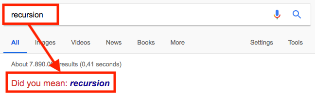

class: title-slide  

# Modul - Objektorientierte Programmierung
### Bachelor Wirtschaftsinformatik

## 07 - Rekursion
### Prof. Dr. Marcel Tilly
Fakultät für Informatik, Cloud Computing

---

# Rekursion

.skip[]

.center[]

---

# Fakultät

- Die Fakultät ist in der Mathematik eine Funktion, die einer natürlichen Zahl das Produkt aller natürlichen Zahlen (ohne Null) kleiner und gleich dieser Zahl zuordnet.
- Sie wird durch ein dem Argument nachgestelltes Ausrufezeichen („!“) abgekürzt. 
- Diese Notation wurde erstmals 1808 von dem elsässischen Mathematiker Christian Kramp (1760–1826) verwendet, der um 1798 auch die Bezeichnung faculté „Fähigkeit“ dafür einführte. 

$$
n! = \begin{cases}
    1 & \text{für n = 1 (terminal)}.\\\
    n \cdot (n-1)! & \text{für n > 1 (rekursiv)}.
  \end{cases}
$$

---

# Fakultät

.center[]

---

# Größter gemeinsamer Teiler (GGT)

```java
int ggT(int a, int b) {
	while (b != 0) {
		if (a > b)
			a = a - b;
		else
			b = b - a;
	}

	return a;
}
```

---

# Größter gemeinsamer Teiler (GGT)

.center[]

---

# Fibonacci

$$
\text{fib}(n) = \begin{cases}
	0 & \text{für } n = 0 \\\
	1 & \text{für } n = 1 \\\
	\text{fib}(n-1) + \text{fib}(n-2) & \text{für } n > 1
\end{cases}
$$

.center[]

.footnote[
Quelle: [Wikipedia](https://commons.wikimedia.org/wiki/File:FibonacciSpiral.svg)
]

---

# Fibonacci

```
fib(5) =>
 |    \
 |     \
fib(4) + fib(3) =>
 |    \    \-----+--------
 |     \          \       \
fib(3) + fib(2) + fib(2) + fib(1) =>
 |    \    \        \
 |     \    \        \------------+----------
 |      \    \---+---------        \         \
 |       \        \        \        \         \
fib(2) + fib(1) + fib(1) + fib(0) + fib(1) + fib(0) + fib(1) =>
 |    \
 |     \
fib(1) + fib(0) + ...
```

---

# Kochrezept

1. **Terminalfälle** bestimmen: Wann ist die Lösung trivial?

2. **Rekursionsfälle** bestimmen: Wie kann ich das Problem auf ein kleineres runterbrechen?

3. Rekursion zusammensetzen: Brauche ich eine Hilfsmethode, wie muss die Signatur aussehen, wie müssen die Argumente beim rekursiven Aufruf verändert werden?

```java
// kein valides Java...
int rekursiv(...) {
	if (Terminalfall) {
		return /* fester Wert */
	} else {
		// Rekursionsfall: mind. 1x rekursiv aufrufen!
		return rekursiv(/* veränderte Argumente*/);
	}
}
```

---

# Arten der Rekursion

- **Lineare Rekursion:** genau ein rekursiver Aufruf, z.B. Fakultät.

- **Repetetive Rekursion** (Rumpfrekursion, engl. _tail recursion_): Spezialfall der linearen Rekursion, bei der der rekursive Aufruf die letzte Rechenanweisung ist.
	Diese Rumpfrekursionen können direkt in eine iterative Schleife umgewandelt werden (und umgekehrt).
	Beispiel: verbesserte Implementierung der Fibonacci Funktion.

- **Kaskadenartige Rekursion:** in einem Zweig der Fallunterscheidung treten _mehrere_ rekursive Aufrufe auf, was ein lawinenartiges Anwachsen der Funktionsaufrufe mit sich bringt.
	Beispiel: einfache Implementierung der Fibonacci Funktion.

- **Verschränkte Rekursion:** Eine Methode `f()` ruft eine Methode `g()`, die wiederum `f()` aufruft.

---

<div style="margin-top: 30%"></div>

# Fragen?

