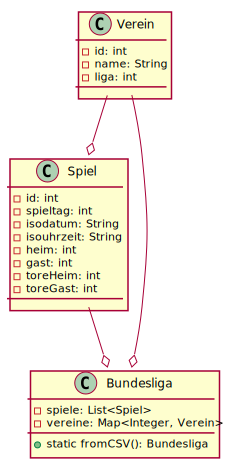

class: title-slide  

# Modul - Objektorientierte Programmierung
### Bachelor Wirtschaftsinformatik

## 10 - Datenverarbeitung
### Prof. Dr. Marcel Tilly
Fakultät für Informatik, Cloud Computing

---

# Datenmodell


.center[]

---

# Datenmodell

## Verein

| V_ID | Name | Liga |
|------|------|------|
| 1    | FC Bayern München | 1 |
| 2    | FC Schalke 04     | 1 |


## Spiel

| Spiel\_ID | Spieltag | Datum | Uhrzeit | Heim | Gast | Tore\_Heim | Tore\_Gast |
|-----------|----------|-------|---------|------|------|------------|------------|
| 1 | 1 | 2017-08-18 | 20:30:00 | 1 | 5 | 3 | 1 |
| 2 | 1 | 2017-08-19 | 15:30:00 | 7 | 12 | 1 | 0 |

---

# Grundoperationen

## Sortieren

- Vereinsliste aufsteigend nach Vereinsname?

- Zuerst nach Liga, dann nach Vereinsname?

---

# Grundoperationen

## Filtern

- **Gegeben**: Liste aller Vereine

- **Gesucht**: Liste aller 2.-Liga-Vereine

 **...und sortiert nach Vereinsname?**

---

# Grundoperationen

## Abbilden

- **Gegeben**: Liste der Spiele

- **Gesucht**: Liste der Spielpaarungen (Datum, Heim, Gast)

---

# Grundoperationen

## Reduzieren

- **Gegeben**: Liste der Spiele

- **Gesucht**: Wie viele Tore wurden insgesamt geschossen?

---

# Aufgaben

## Torstatistiken

1. Wie viele Tore fallen durchschnittlich in jedem Spiel?
2. Wie viele Tore fallen durchschnittlich in einem Spiel der 1. Liga?
3. Wie viele Tore fallen durchschnittlich an einem Spieltag der 2. Liga?
4. Stimmt es, dass in den Nachmittagsspielen (15:30:00) im Schnitt mehr Tore fallen, wie in den Abendspielen?
5. Stimmt es, dass Vereine der 3. Liga zuhause im Schnitt mehr Tore schießen als auswärts?

---

# Aufgaben

## Vereine

1. Wie viele Tore hat der FC Bayern München (Verein 1) erzielt?
2. Wie viele Tore hat der FC Schalke 04 (Verein 2) kassiert?
3. Wie viele Punkte hat der 1. FC Nürnberg (Verein 20)? Ein Sieg zählt 3 Punkte, ein Unentschieden 1, eine Niederlage 0 Punkte.
4. Was ist das Torverhältnis des VfL Bochum (Verein 26), also die Rate von erzielten zu kassierten Toren?
5. Welche drei Vereine haben die meisten Tore zuhause geschossen, und wie viele?
6. Welcher Verein hat die wenigsten Tore auswärts geschossen, und wie viele?

---

# Aufgaben

## 1. Liga

1. Wie ist der aktuelle Tabellenstand? Die Tabelle wird als Vereinsname, gefolgt von Punkten und Torverhältnis definiert.
2. Wie ist der Tabellenstand nach dem 10. Spieltag?
3. Wie ist der Tabellenplatzverlauf des Hamburger SV (Verein 18) über alle 32 Spieltage?
4. Wer hat die [Rote Laterne](https://de.wikipedia.org/wiki/Lanterne_Rouge) in jeweils der 1., 2. und 3. Liga?
5. Wie hat sich die Tabellenführung bis zum 32. Spieltag entwickelt? Die Liste soll nicht einen Verein pro Spieltag haben, sondern immer nur wenn ein neuer Verein die Führung übernimmt (d.h. jeder Eintrag ist von dem vorherigen verschieden).

---

# Verallgemeinerungen

Wie kann man die Grundoperationen (Iterieren, Filtern, Sortieren, Abbilden, Reduzieren) verallgemeinern?

$\rightarrow$ Trennung von Iterations- und Verarbeitungscode!

---

# Iterieren (zum Verbrauch)

```java
interface Consumer<T> {
	void accept(T t);
}

static <T> void fuerJedes(Collection<T> coll, Consumer<T> cons) {
	for (T t : coll)
		cons.accept(t);
}
```

Beispiel: Jedes Element auf `System.out` ausgeben.

```java
List<Integer> li = Arrays.asList(3, 1, 3, 3, 7);
fuerJedes(li, new Consumer<Integer>() {
	public void accept(Integer i) {
		System.out.println(i);
	}
});
```

---

# Filtern

```java
interface Predicate<T> {
	boolean test(T t);
}

static <T> List<T> filtern(Collection<T> liste, Predicate<T> pred) {
	// neue Liste erstellen
	List<T> gefiltert = new LinkedList<>();

	// iterieren...
	for (T v : liste) {
		// Bedingung prüfen...
		if (pred.test(v))
			gefiltert.add(v);
	}

	return gefiltert;
}
```

---

# Abbilden

```java
interface Function<T, R> {
	R apply(T t);
}


static <T, R> List<R> abbilden(List<T> liste, Function<T, R> func) {
	List<R> abgebildet = new LinkedList<>();

	for (T v : liste)
		abgebildet.add(func.apply(v));

	return abgebildet;
}
```

---

# Reduzieren 

#### Version 1

```java
interface BinaryOperator<T> {
	T apply(T a, T b);
}


static <T> T reduzieren(Collection<T> liste, T identity, 
	BinaryOperator<T> op) {
	T a = identity;
	for (T t : liste)
		a = op.apply(a, t);
	return a;
}
```

---

# Reduzieren 

#### Version 2

```java
interface BiFunction<A, B, C> {
	C apply(A a, B b);
}


static <T, U> U reduzieren(Collection<T> liste, U identity, 
	BiFunction<U, T, U> op) {
	U a = identity;
	
	for (T t : liste)
		a = op.apply(a, t);
	
	return a;
	
}
```

---

# Lambda-Ausdrücke

```java
Predicate<Integer> istGerade = new Predicate<Integer> () {
	@Override
	public boolean test(Integer i) {
		return i % 2 == 0;
	}
};
```

**Bedingung:** 

- Interface mit genau einer Methode
- Interface annotiert mit `@FunctionalInterface`

```java
Predicate<Integer> istGerade = (i) -> { return i % 2 == 0; };

// wenn 1 Argument, 1 Anweisung: noch kompakter!
Predicate<Integer> istGerade = i -> i % 2 == 0;
```

---

# Lambda-Ausdrücke

- drastische **Reduktion** von Code!
- drastische **Steigerung** der Lesbarkeit!

## Was macht folgender Code?

```java
List<Integer> li = Arrays.asList(3, 2, 4, 1, 9, 7, 6);

for (Integer i) {
	if (i < 8) {
		double c = Math.sqrt(i);
		if (c > 2)
			System.out.println(c);
	}
}
```

---

# Lambda-Ausdrücke

### Mit Grundoperationen

```java
List<Integer> li = Arrays.asList(3, 2, 4, 1, 9, 7, 6);

li = filtern(li, i -> i < 5);
List<Double> ld = abbilden(li, i -> Math.sqrt(i));
fuerJedes(li, i -> System.out.println(i));
```

### Oder als Stream

```java
Arrays.asList(3, 2, 4, 1, 9, 7, 6).stream()
	.filter(i -> i < 5)
	.map(Math::sqrt)
	.filter(d -> d > 2)
	.forEach(System.out::println);
```

Ist das nicht wirklich kurz und prägnant?!

---

<div style="margin-top: 30%"></div>

# Fragen?
