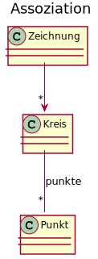
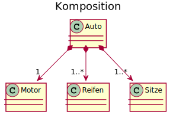
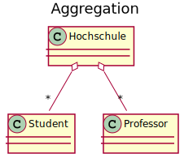
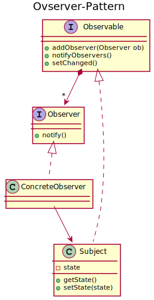
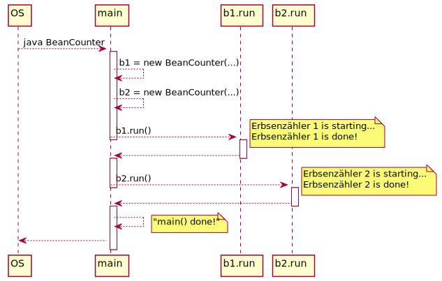
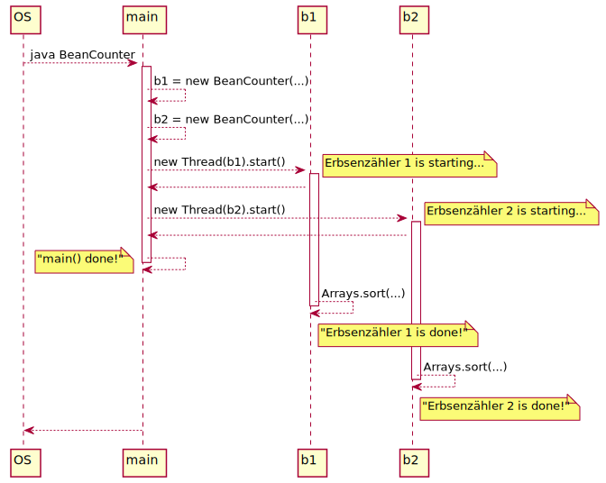
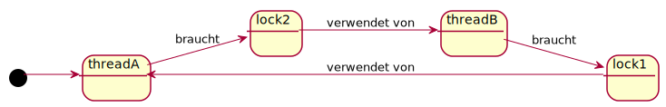
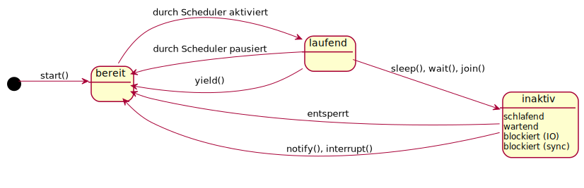

class: title-slide  

# Modul - Objektorientierte Programmierung
### Bachelor Wirtschaftsinformatik

## 12 - UML (recap) & Parallel
### Prof. Dr. Marcel Tilly
Fakultät für Informatik, Cloud Computing

---

# Vererbung (Wiederholung)

- Vererbung bildet in der OOP eine _ist-ein_-Beziehung ab
	- Der Mensch ist ein Säugetier
- Systematische Spezialisierung von oben nach unten
- Die _Unterklasse_ erbt damit alle Merkmale der _Oberklasse_
- Unterklassen erben alle zugreifbaren Member der Basisklasse:
	- Konstruktor und Destruktor
	- Attribute / Klassenvariablen
	- Methoden und Operatoren
- Was wird nicht vererbt?
	- Member die als _private_ deklariert sind
	
---
class: split

# Assoziation

.column[
- lose Verbindung zwischen Objekten (Referenz)
- Objekte kennen sich (Richtung der Referenz)
- Kardinalitäten
- Name
]

.column[
.center[]
]

---

# Komposition

- reale und komplexe Objekte bestehen meist aus kleinen und einfachen Objekte
	- Auto besteht aus Reifen, Motor, Sitzen ...
	- PC besteht aus CPU, Motherboard, RAM, ...

- im objektorientierten Paradigma nennt man diese Beziehung: **Komposition**
- bildet eine _besteht aus_ oder _hat ein_ Beziehung ab

.center[]

---

# Aggregation

- Aggregation ist eine spezielle Form der Komposition
- bildet auch eine _hat ein_ Beziehung ab
- 'Besitz'-Klasse hat jedoch keine Besitzansprüche
	- Referenzierten Klassen leben weiter und werden nicht zerstört wenn die Klasse zerstört wird
	- Referenzierten Klassen werden auch nicht automatisch erstellt wenn die referenzierende Klasse erstellt wird

.center[]

---

# Design Pattern: Oberserver-Pattern

- Das Observer-Pattern ist eines der am meisten genutzten und bekanntesten Patterns
- In diesem Muster gibt es zwei Akteure: Ein Subjekt, welches beobachtet wird und ein oder mehrere Beobachter, die über Änderungen des Subjektes informiert werden wollen
- Die Idee des Observer-Patterns ist es, dem zu beobachtenden Subjekt die Aufgabe aufzutragen, die Beobachter bei einer Änderung über die Änderung zu informieren
- Die Beobachter müssen nicht mehr in regelmäßigen Abständen beim Subjekt anfragen, sondern können sich darauf verlassen, dass sie eine Nachricht über eine Änderung erhalten
---

# Observable and Observer

```java
public interface Observable {
    void addObserver(Observer beobachter);
    void removeObserver(Observer beobachter);
    void notifyObservers();
}
```

```java
public interface Observer {
    void update();
}

```

---

# Design Pattern

#### Oberserver-Pattern (II)

.center[]

---

# Prozesse

```java
class MyProgram {
	String name;
	MyProgram(String name) {
		this.name = name;
		System.out.println("Created MyProgram: " + name);
	}
	void printNum(int n) {
		System.out.println(name + ": " + n);
	}
	public static void main(String[] args) {
		MyProgram mp = new MyProgram("Test");
		for (int i = 0; i < 3; i++)
			mp.printNum(i);
	}
}
```

---

# Prozesse

.center[]

---

# Erbsenzähler

```java
class BeanCounter implements Runnable {
	private final String name;
	private final double[] data;
	BeanCounter(String name, int n) {
		this.name = name; this.data = new double [n];
	}
	public void run() {
		System.out.println(name + " is starting...");
		Arrays.sort(data);
		System.out.println(name + " is done!");
	}
	public static void main(String... args) {
		BeanCounter b1 = new BeanCounter("Erbsenzähler 1", 10000);
		BeanCounter b2 = new BeanCounter("Erbsenzähler 2", 1000);
		b1.run();
		b2.run();
		System.out.println("main() done!");
	}
}
```

---

# Erbsenzähler

.center[]

---

# Fleissige Erbsenzähler mit Threads

```java
public static void main(String[] args) {
	BeanCounter b1 = new BeanCounter("Erbsenzähler 1", 10000);
	BeanCounter b2 = new BeanCounter("Erbsenzähler 2", 1000);
	new Thread(b1).start();
	new Thread(b2).start();
	System.out.println("main() done!");
}
```

---
# Fleissige Erbsenzähler mit Threads

.center[]

---

# Threads: Beispiele

Nebenläufige Programmierung mit Threads ist in allen modernen Applikationen zu sehen:

- Browser: gleichzeitiges Laden und Rendern von Ressourcen auf einer Webseite
- Gleichzeitiges Rendering mehrerer Animationen
- Behandlung von Benutzerinteraktionen wie Klicks oder Wischen
- Sortieren mit Teile-und-Herrsche-Verfahren
- Gleichzeitige Datenbank-, Netzwerk- und Dateioperationen
- Steuerbarkeit von langlaufenden Prozessen

---

# Geteilte Ressourcen

```java
class Counter {
	private int c = 0;
	int getCount() { return c; }
	void increment() { 
		c = c + 1; 
	}
}
class TeamBeanCounter implements Runnable {
	Counter c;
	TeamBeanCounter(Counter c) {
		this.c = c;
	}
	public void run() {
		for (int i = 0; i < 100000; i++)
			c.increment();
		System.out.println("Total beans: " + c.getCount());
	}
}
```

---

# Geteilte Ressourcen

```java
public static void main(String[] args) {
	Counter c = new Counter();
	new Thread(new TeamBeanCounter(c)).start();
	new Thread(new TeamBeanCounter(c)).start();
	new Thread(new TeamBeanCounter(c)).start();
	new Thread(new TeamBeanCounter(c)).start();
}
```

```
Total beans: 362537
```

---

# Geteilte Ressourcen: Inkonsistenz!

Geteilte Ressourcen koennen problematisch sein!


|   | Thread 1 | Thread 2 | _result_ |
| - | -------- | -------- | -------- |
| 1 | tmp1 = c |          | tmp1 = 0 |
| 2 |          | tmp2 = c | tmp2 = 0 |
| 3 | ++tmp1   |          | tmp1 = 1 |
| 4 |          | ++tmp2   | tmp2 = 1 |
| 5 | c = tmp1 |          | c = 1    |
| 6 |          | c = tmp2 | **c = 1 !** |


---

# Deadlock

<div style="margin-top: 30%"></div>

.center[]

---

# `wait` und `notify`

.center[]

---

# Erzeuger-Verbraucher-Problem

.center[]

---

# Threads: Lebenszyklus

<div style="margin-top: 10%"></div>

.center[]

---

<div style="margin-top: 30%"></div>

# Fragen?
