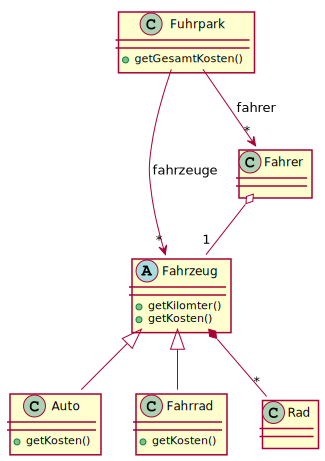
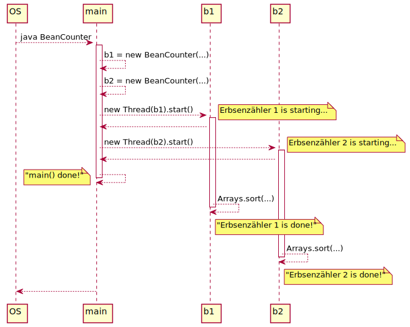

class: title-slide  

# Modul - Objektorientierte Programmierung
### Bachelor Wirtschaftsinformatik

## 13 - Zusammenfassung
### Prof. Dr. Marcel Tilly
Fakultät für Informatik, Cloud Computing

---

# Zusammenfassung

- OOP Konzepte
- Werkzeuge zur Softwareentwicklung
- Datenstrukturen
- Iteration und Rekursion
- Generics
- Datenverarbeitung
- Interfaces, Vererbung und abstrakte Basisklassen
- Parallele Verarbeitung

---

# OOP Konzepte

--

- Generalisierung (Abstraktion)
- Vererbung
- Kapselung
- Polymorphie (Dynamisches Binden, Überschreiben)
- Schnittstellen (Interfaces, Überladen)

---

# Werkzeuge der Softwareentwicklung

--

- Versionierung mit Git
	- `git clone` um Repository lokal auszuchecken
	- `git add` um Dateien zu stagen
	- `git commit` um gestagete Dateien zu committen.
	- `git push` um lokale Commits auf das remote Repository hochzuladen
- IntelliJ
- Refactoring und Design-Pattern
	+ Singleton- , Factory- , Composite- und Observer-Pattern
- Test-Tools
	+ JUnit Unit-Tests

---

# Datenstrukturen

--

## Konzepte (Interfaces)

- Liste: sequenzielle Datenstruktur
- Set: duplikatfreie Menge (ohne Ordnung)
- Map: assoziativer Container

## Realisierungen

- `LinkedList` und `ArrayList`
- `HashSet` ($\rightarrow$ `Object.hashCode`!) und `TreeSet`
- `HashMap` und `TreeMap`

---

# Iteration und Rekursion

--

```java
List<String> list = ...;

for (int i = 0; i < list.size(); i++)
	System.out.println(list.get(i));

// List instanceof Iterable!
for (String s : list)
	System.out.println(s);
```

- Wiederholtes Ausführen mit `for` oder `while`
- Bei Traversierung von Bäumen muss eine _Agenda_ verwendet werden!

---

# Rekursion

Fakultät: f(i) =  1, wenn i=1, sonst f(i) = i*f(i-1) für i>1

```java
int fak(int i) {
	if (i == 1)
		return 1;
	return i * fak(i-1);
}
```

- Terminalfall: Wann ist das Ergebnis trivial?
- Rekursionsfall: Rückführung auf einen einfacheren Fall
- Rekursiver Aufruf mit veränderten Argumenten

---

# Generics

--

.small[
```java
interface List {
	Object get(int i);
	void add(Object o);
}

List list = new ListImpl();
list.add("Hans");
String s = (String) list.get(0);    // OK
Integer i = (Integer) list.get(0);  // oops!
```
]
$\rightarrow$ Keine Typsicherheit zur Laufzeit!

--

.small[
```java
interface List<T> {
	T get(int i);
	void add(T o);
}

List schlecht = new LinkedList();  // Achtung: Object
List<String> liste = new LinkedList<>();

liste.add("Hans");
String s = liste.get(0);

liste.add(4);             // COMPILERFEHLER!
Integer i = liste.get(0); // COMPILERFEHLER
```
]

- Einführung von **Typvariablen** (hier: `T`)
- Typsicherheit zur Compilezeit $\rightarrow$ Typsicherheit zur Laufzeit!

---

# Generics

## Bounds

- Manchmal ist es nötig, Anforderungen an Typargumente zu stellen!
- Beispiel: Realisierung eines `Set` als Binärbaum

```java
interface Set<T> {
	void add(T o);
	boolean contains(T o);
	// ...
}

class SetImpl<T extends Comparable<T>> implements Set<T> {
	// an jedem T können nun die Methoden von 
	// `Comparable` verwendet werden
}
```

---

# Datenverarbeitung

--

## Filter

`List<T>` $\rightarrow$ (i.d.R. kürzere) `List<T>`

## Map

`List<X>` $\rightarrow$ `List<Y>`

---

# Datenverarbeitung

## Reduce

`List<T>` $\rightarrow$ Einzelwert

- `List<T>` $\rightarrow$ `T`: "klassisches" Reduzieren (z.B. Aufsummieren)
- `List<T>` $\rightarrow$ `R`: reduzieren auf anderen Typ (schwieriger)

## Sort

`List<T>` $\rightarrow$ `List<T>` ($\rightarrow$ `Comparator`, `Comparable`)

---

# Interfaces und Vererbung 

--

```java
interface Set<T> {
	void add(T o);
	boolean contains(T o);
}

class StringSetImpl implements Set<String> {
	// ...
	public void add(String s) { ... }
	public boolean contains(String s) { ... }
}

class ChattyStringSetImpl extends StringSetImpl {
	// `add` überschreiben...
    	@Override
	public void add(String s) {
		System.out.println("Füge " + s " hinzu");
		super.add(s);  // so kann man z.B. "alte" Methoden rufen!
	}
}
```

---

# Abstrakte Basisklassen

--

- Interfaces: Schreiben Methoden vor, keine Attribute
- Unterklassen: Erben Methoden _und_ Attribute
- ABC: Kombinieren Vorteile von Interfaces und Klassen

```java
abstract class Musiker {
	String name;
	void ueben() {
		stimmen();
		spielen();
	}
	abstract void stimmen();
	abstract void spielen();
}
```

---

# Abstrakte Basisklassen

```java
class Trompeter extends Musiker {
	void stimmen() {
		System.out.println("Brauch i ned");
	}
	void spielen() {
		System.out.println("Erstma a hoibe");
	}
}
```

- Erbt Attribute und implementierte Methoden: `name` und `ueben()`
- Muss abstrakte Methoden implementieren, oder selbst abstrakt sein

---

# Referenzen

- Assoziation
- Komposition
- Aggregation

.center[]

---

# Parallele Verarbeitung

--

```java
public static void main(String[] args) {
	// BeanCounter implements Runnable!
	BeanCounter b1 = new BeanCounter("Erbsenzähler 1", 10000);
	BeanCounter b2 = new BeanCounter("Erbsenzähler 2", 1000);
	Thread t1 = new Thread(b1);
	t1.start();

	Thread t2 = new Thread(b2);
	t2.start();

	// auf die Threads warten...
	t1.join(); 
	t2.join();

	System.out.println("main() done!");
}
```

---

# Parallele Verarbeitung

.center[]

---

<div style="margin-top: 30%"></div>

# Fragen?
